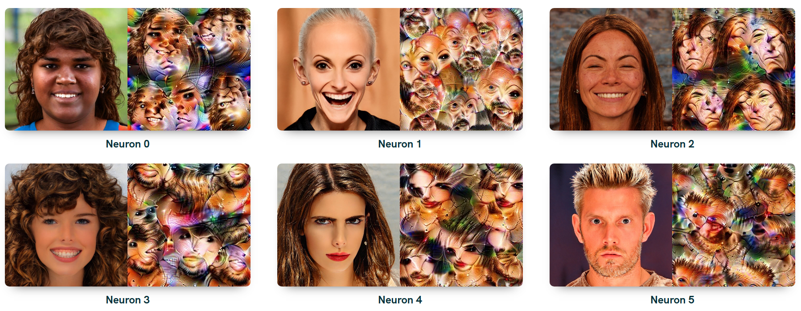
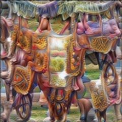

# CelebA & Lucid



This package is a quick access tool of a research project of Alfred Renyi Institute of Mathematics. In our project we use lucid visualizations to get a better understanding how transfer learning manipulates a neural network. As a baseline we took Clarity's InceptionV1 network trained on imagenet and we further trained the network on the CelebA dataset.

# Networks

We've trained three neural networks. One learning 100 epochs with SGD optimizer, one learning 10 epochs with Adam and one learning 100 epochs with Adam. We'll reference these trainings later as **sgd, adam and adam_overfit**, while the baseline will be referenced as **imagenet**.

Details of the trainings:

| Name | Epochs | Train loss | Train Acc | Val loss | Val acc |
| --- | --- | --- | --- | --- | --- |
| sgd  | 100 | 0.16 | 92.7% | 0.18 | 91.9% |
| adam  | 10 | 0.16 | 92.9% | 0.18 | 91.9% |
| adam_overfit  | 100 | 0.01 | 99.3% | 0.93 | 90.8% |

# Setup

## Requirements

Python 3.6+

## Install

```bash
pip install celebalucid
```

# Usage

## Load

First, load either of the networks as
```python
from celebalucid import load_model

# Choose from ['imagenet', 'sgd', 'adam', 'adam_overfit']
model = load_model('imagenet') 
```

## Layer information

Get accessable layers as
```python
model.layer_info
```
Calling this you will see the list of available layers along with the available number of channels (neurons).
```bash
[['conv2d0', 64],
 ['conv2d1', 64],
 ['conv2d2', 192],
 ['mixed3a_1x1', 64],
 ['mixed3a_3x3_bottleneck', 96],
 ...]
```

## Lucid

Visualize a neuron with lucid as

```python
# Default args: size=224, thresholds=[512], progress=False
img = model.lucid('mixed5a_5x5:7', progress=True)
plt.imshow(img)
```


## Weights

You can access the weights of a network as

```python
# Method 1
weights = model.weights.mixed3a_3x3_bottleneck.w 
bias = model.weights.mixed3a_3x3_bottleneck.b

# Method 2
weights = model.weights['mixed3a_3x3_bottleneck'].w 
bias = model.weights['mixed3a_3x3_bottleneck'].b
```

## Activations

*Under development*